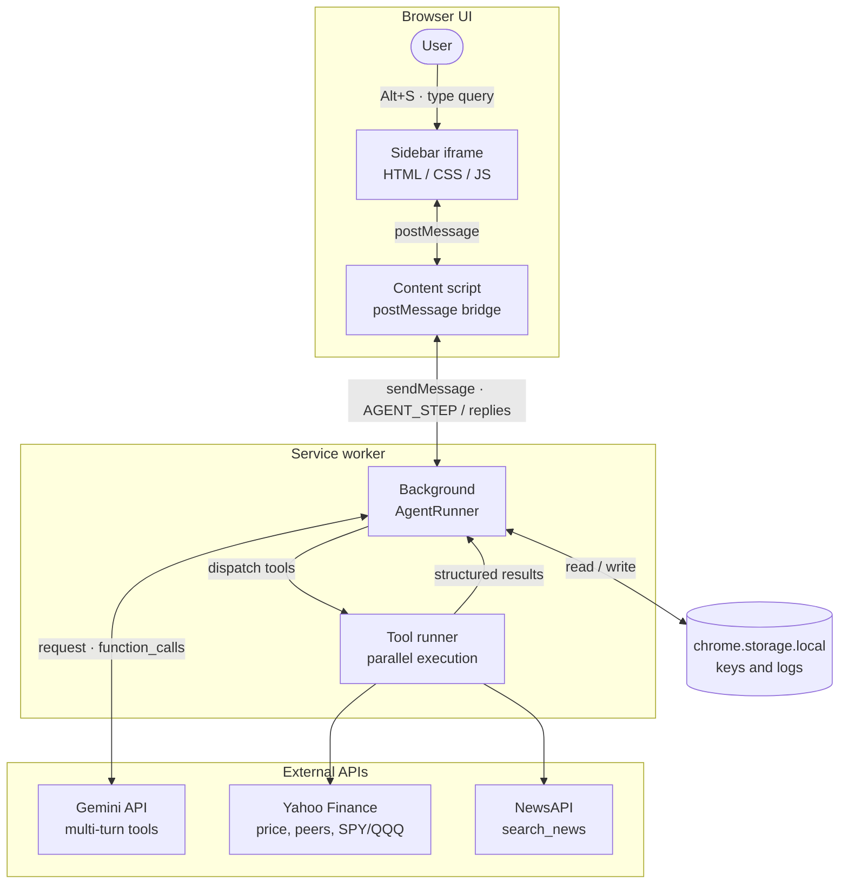
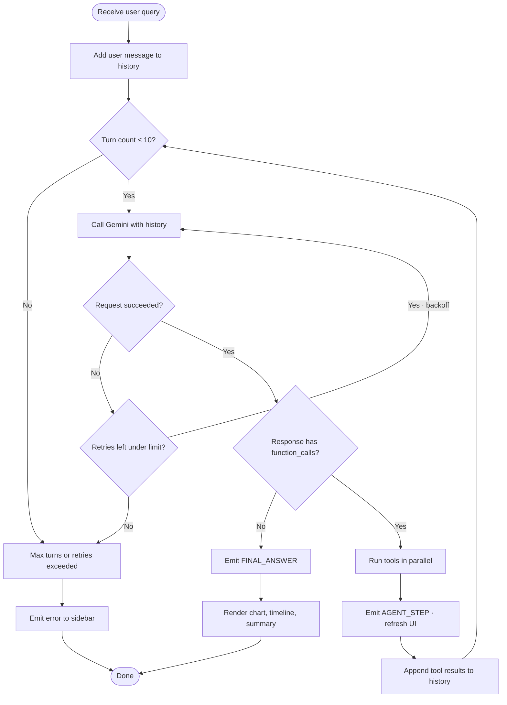

# StockPulse


**Agentic AI stock news intelligence for Chrome.** Type a stock query — the agent fetches live prices, optional peer tickers, broad-market context (SPY/QQQ), English-filtered news, correlates price with headlines (including prior-evening news), runs a compact **driver analysis** step, and delivers a structured markdown report with charts and a clean daily breakdown.

---

## 📋 Overview

StockPulse is a **browser extension** that embeds an intelligent sidebar into any webpage. It combines real-time financial data with AI reasoning to answer natural language questions about stock performance.

**Who is it for?** Investors, traders, and financial enthusiasts who want quick, AI-analyzed summaries of stock movements without leaving their browser.

**Why use it?**
- **Instant answers** — No jumping between tabs or financial websites
- **AI-correlated insights** — The agent connects price movements to news events
- **Live reasoning** — Watch the AI's thinking process step-by-step
- **Always available** — Sidebar works on any webpage via keyboard shortcut (`Alt+S`)

---

## 🎬 Demo video

<!-- GitHub’s README view needs an absolute raw URL; relative paths often render an empty player. -->
<video controls playsinline preload="metadata" width="100%" style="max-width: 48rem; border-radius: 8px;">
  <source src="https://raw.githubusercontent.com/mkthoma/stockpulse/main/assets/Stockpulse%20Demo.mp4" type="video/mp4">
  <a href="https://github.com/mkthoma/stockpulse/blob/main/assets/Stockpulse%20Demo.mp4">Open demo video (MP4)</a>
</video>

[Open video on GitHub](https://github.com/mkthoma/stockpulse/blob/main/assets/Stockpulse%20Demo.mp4) · [Raw MP4](https://raw.githubusercontent.com/mkthoma/stockpulse/main/assets/Stockpulse%20Demo.mp4)

---

## ✨ Features

- 🤖 **Multi-turn Gemini AI agent** — Up to **10** turns with parallel tool execution, trimmed tool results in history, and recovery when the model returns empty output
- 💹 **Real-time price data** — Yahoo Finance chart API (no API key required)
- 🧭 **Market & peer context** — SPY/QQQ baseline and Yahoo “recommended symbols” peers (graceful fallback if peer data fails)
- 📰 **News correlation** — NewsAPI with `language=en`, headline heuristics (`lib/isEnglishHeadline.js`) so the UI stays **English-only** even when sources are mis-tagged
- 🧠 **Driver-style analysis** — `summarise_findings` compresses correlated data into key events (vs market, driver types); heavy lifting stays in JS, not in giant function-call JSON
- 🔄 **Live reasoning chain** — Every tool call and result streamed to the sidebar
- 📊 **Interactive price chart** — Chart.js daily view
- 📅 **Daily breakdown** — Card-style rows: date, move %, up to two truncated headlines; significant days highlighted
- 🪟 **Glass UI** — Frosted sidebar + host-page backdrop blur; dark forest green palette and `assets/stockpulse_logo_icon.svg` branding in sidebar, popup, and options
- ⚙️ **Options page** — API keys, model picker, optional LLM logs
- 🌙 **Dark mode** — Follows system preference in the sidebar
- ⌨️ **Keyboard shortcut** — `Alt+S` toggles the sidebar
- 🔐 **Privacy-first** — Keys in `chrome.storage.local`; only Gemini, NewsAPI, and Yahoo Finance are called from the extension

---

## 📸 Screenshots

Same sidebar run, query *“analyze nvidia stock this week”*. (Source PNGs: [`assets/`](assets/).)


**What you’re seeing**

1. **Reasoning chain** — Live steps: `get_stock_price` / `get_peer_tickers`, then `search_news` / `get_market_context`, then `correlate_price_to_news`. Transparency: which data fed the answer.
2. **Chart + breakdown** — Price line, **`summarise_findings(NVDA)`**, and **Daily Breakdown** (English headlines).
3. **Report** — Markdown sections rendered as cards: **Summary**, **Key price events**, **Peer & sector context**, **Conclusion**.

---

## 🧠 Agent design & rationale

StockPulse is **one Gemini-driven agent** (multi-turn function calling), not a fleet of separate LLMs. The “agents” in the product sense are **specialized tools** the model invokes; the **reasoning chain UI** exposes those steps for trust and debugging. Below is why each piece exists and how the design avoids common failure modes.

### Why tool-based analysis instead of “prompt only”?

- **Grounding:** Price and news must come from live APIs; the model should not invent dates, returns, or headlines.
- **Decomposition:** Financial questions naturally split into *fetch price*, *fetch news*, *fetch market baseline*, *merge*, *classify drivers* — matching how analysts work.
- **Transparency:** Each tool call is logged in the sidebar so users can verify inputs (ticker, period, `from_date`) and outputs (record counts, errors).

### Per-tool rationale

| Piece | Why it was implemented |
|-------|------------------------|
| **`get_stock_price`** | Canonical OHLCV from Yahoo for the user’s ticker and horizon (`1d`–`90d`). Everything else (news dates, correlation) keys off this series. |
| **`get_peer_tickers`** | “Why did it move?” often depends on sector peers. Yahoo recommendation endpoints supply **dynamic** peers — **no hardcoded peer list** (avoids stale tickers and licensing/maintenance issues). When Yahoo fails, the tool returns `status: warning` and empty peers so the run continues. |
| **`get_market_context`** | Raw stock % moves are misleading without **SPY/QQQ** over the same window. This tool encodes “market beta vs idiosyncratic move” so the LLM and downstream logic can separate a broad rally from a stock-specific story. |
| **`search_news`** | NewsAPI fills the narrative layer. **`language=en`** plus **`isEnglishHeadline`** filtering fixes mis-tagged multilingual feeds so the **UI and correlation** stay readable (no long mixed-language “ticker” strings). A larger fetch window then **slice to 15** English articles preserves quota usefulness. |
| **`correlate_price_to_news`** | Joins prices and articles **by trading day**. **Prior-evening** headlines are attributed to the **next** session so overnight news isn’t orphaned — a common gap in naive same-day-only correlation. |
| **`summarise_findings` (model-visible)** | After correlation, asking the model to call a tool with the **full timeline + market JSON** as arguments caused **empty responses and stalls** (output token pressure). This tool only takes **`ticker`**; **`AgentRunner`** injects cached `timeline` and `market_context`. |
| **`analyse_price_drivers` (internal)** | Deterministic classification (e.g. earnings vs `market_move` vs `unexplained`) and relative-vs-SPY scoring stays in **JavaScript** for consistency, testability, and **no extra LLM cost**. It is **not** exposed as a separate Gemini tool so the orchestrator cannot accidentally pass huge blobs into it. |

### Orchestration & robustness (`AgentRunner` / `GeminiClient`)

- **`trimForHistory`:** Strips bulky fields from tool results before they go back into Gemini history so later turns don’t blow the context/output budget.
- **Session cache:** Holds raw correlate + market context for the current query so **`summarise_findings`** runs on full data without serializing it through the model.
- **Turn budget & recovery:** Up to **10** turns; **nudges** after empty model responses; **`MAX_TOKENS`** handled as non-fatal when partial tool output is still usable.
- **Dynamic system instruction:** **Today’s date** and suggested **`from_date`** anchors reduce stale NewsAPI windows (plan limits / “too far in the past” errors).

### UX goals

- **Reasoning chain** → auditability (“what did the agent actually do?”).  
- **Chart + daily breakdown** → intuitive scan of the week.  
- **Section cards** in the final markdown → skimmable institutional-style memo.

---

## 🏗️ Architecture

### System Overview



*UI updates flow back along the same path: background → content script → `postMessage` → sidebar (reasoning chain, chart, final markdown).*

### Message Flow

```
┌─────────────────────────────────────────────────────────────────┐
│ User types query in sidebar                                     │
└─────────────────┬───────────────────────────────────────────────┘
                  │ postMessage
                  ▼
┌─────────────────────────────────────────────────────────────────┐
│ content.js receives message, forwards via chrome.runtime        │
└─────────────────┬───────────────────────────────────────────────┘
                  │ chrome.runtime.sendMessage
                  ▼
┌─────────────────────────────────────────────────────────────────┐
│ background.js (Service Worker)                                  │
│ AgentRunner.runAgentLoop() starts                               │
│                                                                 │
│ ┌─────────────────────────────────────────────────────────────┐ │
│ │ LOOP (max 10 turns):                                        │ │
│ │  1. addUserMessage(query) to history                        │ │
│ │  2. callGemini(history) → response                          │ │
│ │  3. Extract function_calls from response parts              │ │
│ │  4. Dispatch tools in parallel                              │ │
│ │  5. Emit AGENT_STEP event (with reasoning data)             │ │
│ │  6. Add tool results to history                             │ │
│ │  7. If text response → emit FINAL_ANSWER, break             │ │
│ └─────────────────────────────────────────────────────────────┘ │
└─────────────────┬───────────────────────────────────────────────┘
                  │ chrome.tabs.sendMessage(AGENT_STEP)
                  ▼
┌─────────────────────────────────────────────────────────────────┐
│ content.js receives step, forwards to sidebar iframe            │
└─────────────────┬───────────────────────────────────────────────┘
                  │ postMessage
                  ▼
┌─────────────────────────────────────────────────────────────────┐
│ sidebar/sidebar.js renders:                                     │
│  • ReasoningChain.addStep(step) → reasoning list                │
│  • ToolCard.setStatus() → running/done/error states             │
│  • On final_answer:                                             │
│    - TimelineChart + ResultsPanel timeline (English headlines)  │
│    - ResultsPanel renders markdown in section cards             │
└─────────────────────────────────────────────────────────────────┘
```

### Host page overlay

`content/content.js` injects the sidebar iframe and a full-viewport **backdrop** (blur + tint). Clicking the backdrop closes the sidebar so the panel reads as a focused “glass” surface over the page.

---

## 🔧 Agent Tools

Tools exposed to Gemini (see `agent/GeminiClient.js`). Implementations live under `agent/tools/`.

| Tool | Purpose | Parameters | Data source / notes |
|------|---------|------------|---------------------|
| `get_stock_price` | OHLCV history | `ticker`, `period` (1d / 7d / 30d / 90d) | Yahoo Finance chart API |
| `get_peer_tickers` | Related tickers for context | `ticker` | Yahoo recommendations (multi-endpoint; may return `status: warning` with empty peers) |
| `get_market_context` | Broad market moves vs stock | `period` (same as price) | SPY + QQQ via same price helper |
| `search_news` | Recent articles | `query`, `from_date` (ISO) | NewsAPI `everything` with `language=en`, larger page fetch, then **English headline filter**; returns up to 15 articles |
| `correlate_price_to_news` | Join prices and news by trading day | `prices`, `news_articles` | Pure JS; includes **prior-evening** headlines mapped to the next session |
| `summarise_findings` | Compact driver summary after correlation | `ticker` (+ optional `significance_threshold`) | Pure JS; **timeline + market context are injected** from a session cache in `AgentRunner.js` so the model never re-emits large JSON. Internally calls `analyse_price_drivers` (not model-visible). |

Shared utility:

| Module | Role |
|--------|------|
| `lib/isEnglishHeadline.js` | Script detection; used by `search_news` and sidebar timeline rendering |

### Agent implementation notes

- **History size:** Large tool payloads are trimmed before being appended to Gemini history (`trimForHistory` in `AgentRunner.js`) so follow-up turns are less likely to hit output limits.
- **Session cache:** After `correlate_price_to_news` and `get_market_context`, raw results are cached for the current run so `summarise_findings` receives full `timeline` / `market_context` without the model copying them into function arguments.
- **Gemini config:** `GeminiClient.js` injects **today’s date** and suggested `from_date` anchors in the system instruction, maps **per-model `maxOutputTokens`**, treats `MAX_TOKENS` as non-fatal when partial tool output exists, and retries transient failures.
- **Empty responses:** A short user nudge is inserted (limited retries) if the model returns no parts.

---

## 🤖 Agent Loop Flowchart



*Retries use exponential backoff in code (transient API errors); the diagram collapses that into one decision node to keep the layout readable.*

---

## 📁 File Structure

```
stock_pulse/
├── manifest.json                    # Extension metadata & permissions (MV3)
├── README.md                        # This file
├── background.js                    # Service worker: agent orchestration, messaging
├── .gitignore
├── package.json                     # Dev dependencies
├── package-lock.json
│
├── assets/
│   ├── stockpulse_logo_icon.svg    # Brand mark (sidebar, popup, options)
│   ├── StockPulse Screenshot.png   # README: reasoning chain
│   ├── StockPulse Screenshot 2.png # README: chart + breakdown
│   └── StockPulse Screenshot 3.png # README: final report sections
│
├── icons/
│   ├── 16.png, 48.png, 128.png     # Toolbar icons (see manifest `action.default_icon`)
│   └── generate.js / generate.cjs  # Optional icon build scripts
│
├── popup/
│   ├── popup.html / popup.js       # Quick open + branding
│
├── options/
│   ├── options.html / options.js / options.css
│                                   # Gemini + NewsAPI keys, model, logs
│
├── content/
│   ├── content.js                  # Injects sidebar iframe + backdrop blur
│   └── content.css
│
├── agent/
│   ├── AgentRunner.js              # Multi-turn loop (10 turns), session cache,
│   │                               # history trimming, empty-response nudges
│   ├── GeminiClient.js             # Tools, dynamic system date hints,
│   │                               # per-model maxOutputTokens, MAX_TOKENS handling
│   ├── HistoryManager.js
│   └── tools/
│       ├── get_stock_price.js
│       ├── get_peer_tickers.js
│       ├── get_market_context.js
│       ├── search_news.js          # NewsAPI + English headline filter
│       ├── correlate.js
│       ├── summarise_findings.js   # Model-callable summary (uses analyse_price_drivers)
│       └── analyse_price_drivers.js # Internal classification (not in TOOL_DEFINITIONS)
│
├── sidebar/
│   ├── sidebar.html / sidebar.js / sidebar.css
│   ├── AnimationManager.js
│   ├── ReasoningChain.js
│   ├── TimelineChart.js
│   └── ResultsPanel.js             # Markdown section cards + daily breakdown
│
├── lib/
│   ├── chart.min.js                # Chart.js v4 (vendored)
│   └── isEnglishHeadline.js        # Latin-script headline heuristic
│
├── tests/
│   ├── tools.test.js               # Tool unit tests
│   ├── agent.test.js               # Agent / history tests
│   └── animation.test.js           # Animation manager (jsdom)
│
├── .vscode/
│   └── launch.json                 # Debug config (optional)
│
└── docs/
    ├── API.md                      # Gemini API call examples
    ├── TOOLS.md                    # Tool implementation details
    └── DEVELOPMENT.md              # Dev workflow & debugging
```

---

## 🚀 Getting Started

### Prerequisites

- **Chrome or Chromium browser** (version 100+)
- **Gemini API key** (free at [https://aistudio.google.com/app/apikey](https://aistudio.google.com/app/apikey))
- **NewsAPI key** (free at [https://newsapi.org/register](https://newsapi.org/register))
- **Node.js** 16+ (for development and tests only)

### Installation

1. **Clone or download** the repository:
   ```bash
   git clone https://github.com/yourusername/stock_pulse.git
   cd stock_pulse
   ```

2. **Open Chrome Extensions page:**
   - Open Chrome → press `Ctrl+Shift+X` (Windows) or `Cmd+Shift+X` (Mac)
   - Or navigate to `chrome://extensions/`

3. **Enable Developer Mode:**
   - Toggle **Developer mode** (top-right corner)

4. **Load the extension:**
   - Click **"Load unpacked"**
   - Select the `stock_pulse` folder
   - The StockPulse icon should appear in your toolbar

5. **Configure API keys:**
   - Click the StockPulse icon → **Settings**
   - Enter your **Gemini API key** and **NewsAPI key**
   - Select your preferred **Gemini model**
   - Click **Save**

6. **Test it out:**
   - Open any webpage
   - Press `Alt+S` (Windows) or `Option+S` (Mac) to toggle the sidebar
   - Type a stock query (e.g., "Analyse Tesla this week")
   - Watch the agent reason in real-time!

---

## ⚙️ Configuration

| Setting | Type | Description | Default |
|---------|------|-------------|---------|
| **Gemini API Key** | String | Your API key from aistudio.google.com | — |
| **NewsAPI Key** | String | Your API key from newsapi.org | — |
| **Gemini Model** | Select | AI model version to use | `gemini-3.1-flash-lite-preview` |
| **Show LLM Logs** | Toggle | Display raw LLM call history | OFF |
| **Dark Mode** | Select | Light / Dark / Auto (system) | Auto |

**Model Options:**
- `gemini-3.1-flash-lite-preview` — Fast, free, recommended
- `gemini-2.5-flash` — Faster reasoning
- `gemini-3-flash-preview` — Latest preview model
- `gemini-2.5-flash-lite` — Lite version

All settings are stored in `chrome.storage.local` on your machine. **No data is sent to external servers** except Gemini, NewsAPI, and Yahoo Finance APIs.

---

## 💡 Usage Examples

### Example 1: Weekly analysis
**Query:** "Analyse Tesla this week"

**Typical agent flow:**
1. Parallel: `get_stock_price`, `get_peer_tickers`, `get_market_context`, `search_news` (with dates aligned to “this week” via system instructions)
2. Optional extra `search_news` for peer companies if peers exist
3. `correlate_price_to_news` → annotated days (same-day + prior-evening news)
4. `summarise_findings("TSLA")` → compact driver summary vs SPY/QQQ
5. Final markdown: Summary / Key Price Events / Peer & Sector Context / Conclusion — rendered as **section cards** in the sidebar

### Example 2: Price drop investigation
**Query:** "Why did AAPL drop?"

Similar pattern with a longer `period` (e.g. 30d), news search around the drop, **correlate**, then **summarise_findings** for a narrative tied to market context.

### Example 3: Month-long move
**Query:** "What moved NVDA over the last month?"

Uses `30d` prices, English-filtered news, peer/market tools when useful, then correlation + summary.

### Example 4: Peer-aware week
**Query:** "Analyze NVDA this week"

Expect parallel fetches, optional peer news, **correlate_price_to_news**, **summarise_findings**, and a final answer that compares NVDA to SPY/QQQ and calls out driver types (e.g. `market_move` vs stock-specific catalysts).

---

## 🛠️ Development

### Install Dependencies

```bash
npm install
```

### Run Tests

```bash
# Run all tests
npm test

# Watch mode (re-run on file changes)
npm test -- --watch

# Coverage report
npm run test:coverage
```

**Test Files:**
- `tests/tools.test.js` — Unit tests for price fetching, news search, correlation
- `tests/agent.test.js` — Agent loop, history management, multi-turn reasoning
- `tests/animation.test.js` — Animation manager and UI state transitions

### Generate Icons

```bash
npm run icons
```

Generates `icons/icon-{16,48,128}.png` from `icons/generate-icons.js`.

### Fetch Chart.js Library

```bash
npm run get-chart
```

Downloads Chart.js v4 to `lib/chart.min.js` (already committed, no need to run unless updating).

### Local Testing & Debugging

1. **In Chrome DevTools:**
   - Right-click extension icon → **Manage extensions**
   - Open the extension's `background.js` in the DevTools (click "service worker")
   - Set breakpoints in `AgentRunner.js` and step through the loop

2. **Inspect sidebar:**
   - Open DevTools on any webpage
   - In `console`, run: `window.top.frames[0].console` to inspect iframe logs
   - Or: open iframe source in DevTools Network tab

3. **Live reload:**
   - Make a code change
   - Go back to `chrome://extensions`
   - Click the **reload** button for StockPulse

### Common Development Tasks

| Task | Command | Notes |
|------|---------|-------|
| Test single file | `npm test -- tools.test.js` | Runs Jest with file filter |
| Debug in Chrome | Open DevTools on popup/sidebar | Standard Chrome debugging |
| Check bundle size | `du -sh stock_pulse/` | Current folder size |
| Lint (optional) | Add ESLint config | Not included by default |

---

## 🔐 Permissions Explained

StockPulse requests these Chrome permissions in `manifest.json`:

| Permission | Purpose | Why Needed |
|-----------|---------|-----------|
| `storage` | Read/write API keys and LLM call logs | Stores user config in `chrome.storage.local` |
| `activeTab` | Access current tab | For the `Alt+S` keyboard shortcut |
| `scripting` | Inject content script | To embed the sidebar iframe on any webpage |
| `host_permissions: <all_urls>` | Make API calls from extension context | Fetch data from Yahoo Finance, NewsAPI, Gemini API |

**Why not use your webpage's context?**
- Avoids CORS issues (extension context bypasses cross-origin restrictions)
- Protects your API keys (not exposed to webpage JavaScript)
- Provides a cleaner security boundary

---

## 🛡️ Privacy & Security

- **API keys stored locally:** Keys are saved only in `chrome.storage.local` on your machine. Never transmitted except to official APIs.
- **Keys never logged:** Every LLM call is logged for debugging, **but API keys are explicitly scrubbed** before logging.
- **No tracking:** StockPulse does not send usage data, telemetry, or analytics anywhere.
- **Third-party calls:** Only Gemini API, NewsAPI, and Yahoo Finance receive your queries/data.
- **Open-source:** Review the code anytime to verify what's happening.

---

## 🧰 Tech Stack

| Layer | Technology | Version | Purpose |
|-------|-----------|---------|---------|
| **Extension Runtime** | Chrome Manifest V3 | — | Browser extension framework |
| **Language** | JavaScript (ES Modules) | ES2020+ | Core logic, no transpilation needed |
| **AI Model** | Gemini API | Latest | Multi-turn reasoning & tool calling |
| **Price Data** | Yahoo Finance Chart API | v8 | Real-time OHLCV data |
| **News Data** | NewsAPI | v2 | Recent article search |
| **Charting** | Chart.js | v4 | Interactive price visualization |
| **Testing** | Jest | Latest | Unit & integration tests |
| **Test Environment** | JSDOM | — | Browser simulation for tests |

---

## 📄 License

MIT License — Feel free to use, modify, and distribute.

---

## 🤝 Contributing

Contributions welcome! Please:
1. Fork the repo
2. Create a feature branch (`git checkout -b feature/my-feature`)
3. Write tests for new functionality
4. Submit a pull request

---

## ❓ FAQ

**Q: Is my data safe?**  
A: Yes. API keys are stored locally, never logged or shared. Only Gemini, NewsAPI, and Yahoo Finance receive your requests.

**Q: Can I use this on multiple browsers?**  
A: Currently Chrome/Chromium only. Edge, Brave, and other Chromium-based browsers should work (tested on Edge).

**Q: How many stock queries can I make?**  
A: Depends on your API quotas. Gemini free tier is generous. NewsAPI has a 100 req/day limit on free plan.

**Q: Can I ask about cryptocurrency?**  
A: Yes! Any ticker symbol works (BTC, ETH, etc.) if Yahoo Finance has data for it.

**Q: What if the sidebar is slow?**  
A: Check your internet connection and API key validity in Settings. Gemini calls can take 5-10s depending on response complexity.

---

## 📞 Support

Found a bug? Have a feature idea?  
- Open an issue on GitHub
- Check `docs/DEVELOPMENT.md` for debugging tips
- Review test files for usage patterns

---

**Last updated:** April 2026  
**Maintainer:** [Your Name]  
**Repository:** https://github.com/yourusername/stock_pulse
